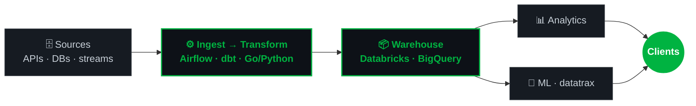

Data Engineer building scalable data infrastructure for US tech companies. 8+ years architecting ETL pipelines, data platforms, and real-time processing systems — from fintech to gaming to social media at scale.

### What I do

### Currently

- Building [**Bonavia**](https://bonavia.app) — crowdsourced road quality mapping platform for Brazilian roads (React + Flask + React Native)
- Applying to **Georgia Tech OMSCS** — MS in Computer Science (AI + Distributed Systems + Robotics)

### Open Source

 — Data engineering & ML toolkit for Go. Zero dependencies, 7 ML algorithms, generics-first.

 — Zero-config data quality monitoring. Connect, profile, detect anomalies — 3 commands, no YAML.

### Stack

`Golang` `Python` `Databricks` `Airflow` `BigQuery` `dbt` `PySpark` `Cloud Composer` `Airbyte` `Superset` `PostgreSQL` `React` `TypeScript` `AWS` `GCP` `Azure`

### Beyond code

Climber, trekker, triathlete. Endurance sports taught me that the boring, incremental approach is slower to start — but it actually finishes.

---

**German citizen** | Based in Brazil | EST-aligned | 5 languages (EN, PT, ES, IT, DE)
